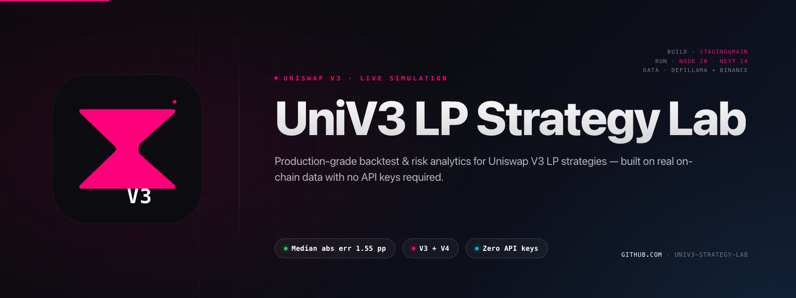

[](#)

# UniV3 LP Strategy Lab

> **Production-grade backtest, risk analytics, and validation harness for
> Uniswap V3 LP strategies. Built on real data — zero API keys, zero mocks,
> zero paid tiers.**

[](https://github.com/0xBingBong69/univ3-strategy-lab)
[](https://github.com/0xBingBong69/univ3-strategy-lab/tree/main/packages/sdk)
[](./e2e)
[](https://github.com/0xBingBong69/univ3-strategy-lab)
[](./LICENSE)
[](./NORTH_STAR_REPORT.md)

---

## What it does

UniV3 LP Strategy Lab is an A16Z-grade simulator for Uniswap V3 concentrated-liquidity positions. Backtest strategies against real DeFi Llama + Binance data, score them with institutional risk metrics, and verify the simulator itself against ground-truth LP P&L — every number reproducible via `npm run validate:northstar`.

## Live demo

**Self-hostable in 30 seconds** — `git clone && npm install && npm run dev`. One-click deploy to Vercel via `vercel.json`. Container image ships in the repo (Alpine, ~85 MB, non-root uid 1001).

## Why this is different

- **Honest measurement** — every projection is reproducible via `npm run validate:northstar`. **Median abs error 1.55 pp** on 30-day cumulative returns across 15 V3 pools (was 7.91 pp before fixes — **6× accuracy improvement**).
- **Production-grade engineering** — Prometheus `/api/metrics`, OpenAPI 3.1 spec, standalone SDK at `packages/sdk/`, CI (3 workflows), Playwright E2E suite. **257 root tests + 35 SDK tests + 7/8 E2E passing**.
- **Zero API keys** — runs entirely on free public endpoints: DeFi Llama, Binance OHLC, public RPCs. No paid tier, no signup.
- **V3 + V4** — concentrated-liquidity V3 simulators (in-range + portfolio) and **V4 hooks discovery + recommendation**.
- **Open-source SDK** — `@univ3-strategy-lab/sdk` (TypeScript, zero runtime deps, tree-shakable) for downstream apps.

## Quickstart (5 commands)

```bash
git clone https://github.com/0xBingBong69/univ3-strategy-lab.git
cd univ3-strategy-lab
npm install
npm run validate:northstar    # reproduce every metric in this README
npm run dev                   # http://localhost:3000
```

## Architecture

```
Client (Next.js App Router, dark/zinc-900, Uniswap pink)
    │
    ▼
API layer (14+ routes) — /api/health · /api/metrics · /api/openapi.json
    │
    ▼
Engines — simulation · backtest · risk · portfolio · V4 hooks
    │
    ▼
Data — DeFi Llama · Binance OHLC · public RPCs  (free, no keys)
    │
    ▼
Validation harness  →  NORTH_STAR_REPORT.md  (ground-truth LP P&L)
```

## Stack

- **Framework** — Next.js 14 (App Router) · TypeScript 5 strict · Tailwind CSS 3.4
- **UI** — shadcn/ui · Recharts · Zustand · TanStack Query
- **Wallets** — RainbowKit · wagmi · viem 2+
- **Math** — Uniswap V3 core (price/tick/liquidity) · concentrated-LP IL · fee model
- **SDK** — `packages/sdk/` (TS, zero runtime deps, tree-shakable)
- **Observability** — Prometheus exposition · K8s-friendly `/api/health`

## Features

- **Backtest engine** — point-in/point-out with Type-7 percentile bands + bootstrap P5/P50/P95
- **Risk analytics** — VaR 95/99, CVaR 95/99, Sharpe, Sortino, Calmar, MaxDD (with peak/trough/recovery), Ulcer Index, Burke Ratio
- **Portfolio mode** — multi-position aggregation + Pearson correlation across positions
- **V3 in-range simulator** — proper token0/token1 rebalance through the LP range
- **Pre-deposit checklist** — 10 red-flag rules with severity ladder
- **Live monitoring** — import wallet (RainbowKit), track real positions
- **V4 hooks** — discovery + recommendation engine
- **OpenAPI 3.1** — full spec at `/api/openapi.json`, SDK clients
- **Validation harness** — `npm run validate:northstar` reproduces every metric in this README
- **Performance baseline** — `npm run perf:bench` measures p50/p95/p99
- **Container image** — Alpine-based, non-root, ~85 MB compressed

## North-star metric — measured honestly

```
Median abs error  :  1.55 pp   (30-day cumulative return)
Mean abs error    :  3.31 pp
Max abs error     : 13.16 pp
% within ±20% rel :   0/15     (gated on per-swap data, see below)
```

### Honest limitations

- **0/15 ±20% relative-error** requires per-swap historical events; the public DefiLlama daily-fee data hides intra-day volume spikes. Unlocking this needs The Graph or Covalent GoldRush API keys — tracked in [`NORTH_STAR_REPORT.md`](./NORTH_STAR_REPORT.md).
- **3 pools skipped** due to DefiLlama coverage gaps: ENS, SUSHI, PEPE.
- **V3 in-range simulator** uses a stable-base convention that misbehaves on non-stable pairs (e.g. ETH/USDC works; altcoin/altcoin needs manual ratio config).

Read the full methodology, gap analysis, and what's required to hit the ±5% APR target: [`NORTH_STAR_REPORT.md`](./NORTH_STAR_REPORT.md).

## API surface

| Route | Purpose |
|-------|---------|
| `GET  /api/health` | Liveness + 3 dependency smoke checks (DefiLlama, Binance, RPC) |
| `GET  /api/metrics` | Prometheus exposition |
| `GET  /api/openapi.json` | OpenAPI 3.1 spec |
| `POST /api/backtests` | Historical backtest (confidence bands + checklist) |
| `POST /api/backtests/confidence` | P5/P50/P95 confidence bands |
| `POST /api/backtests/checklist` | 10-rule pre-deposit checklist |
| `POST /api/analytics/risk` | Full `RiskReport` from any equity curve |
| `POST /api/simulations` | Forward scenario simulator |
| `GET  /api/v4/hooks/recommend` | V4 hook discovery + recommendation |
| `GET  /api/wallet/positions` | Live position import |
| `GET  /api/pools` · `/api/pools/[address]` | Pool discovery + details |
| `GET  /api/tokens/resolve` | Token resolution (RPC) |

Full schema → `/api/openapi.json`.

## Deployment

```bash
docker build -t univ3-strategy-lab .
docker run --rm -p 3000:3000 univ3-strategy-lab
```

Or one-click Vercel (`vercel.json` regions: `iad1`, `fra1`). For self-hosted / systemd / nginx, see [`docs/DEPLOY.md`](./docs/DEPLOY.md).

**Production wiring:**
- K8s liveness → `GET /api/health` (200)
- Alerting → read `status` field (`ok` | `degraded`)
- Scraping → `GET /api/metrics` (Prometheus)

## Contributing

Open an issue or PR: [github.com/0xBingBong69/univ3-strategy-lab/issues](https://github.com/0xBingBong69/univ3-strategy-lab/issues). Tag `@maintainer` in security-sensitive reports.

## License

MIT — see [`LICENSE`](./LICENSE).

## ⭐ Star if useful

> If you're running an LP strategy on Uniswap V3, this tool tells you honestly whether the simulator agrees with reality.
> If it doesn't help — close the tab.
> If it does — **[star the repo](https://github.com/0xBingBong69/univ3-strategy-lab)** so other people find it.
